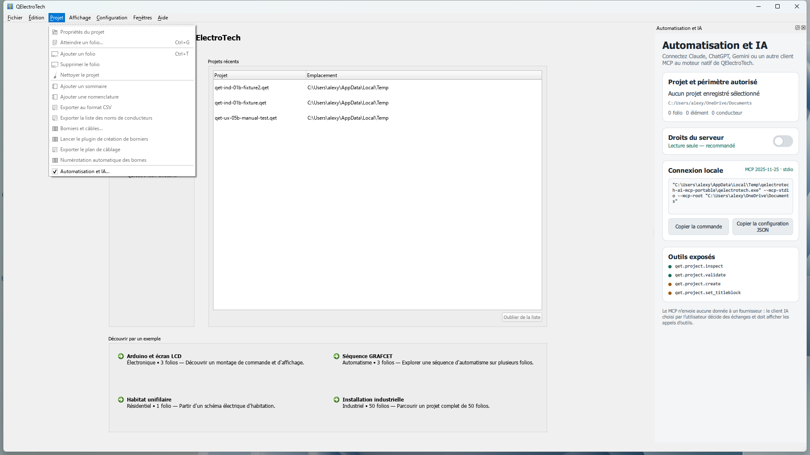

<p align="center">
  
</p>

# QElectroTech — fork ergonomie et automatisation

[](https://github.com/GameKnightt/qelectrotech-source-mirror/actions/workflows/windows-build.yml)
[](LICENSE)
[](https://qelectrotech.org/)

Ce dépôt est un fork communautaire non officiel de
[QElectroTech](https://qelectrotech.org/), un logiciel libre de création de
schémas électriques, d’automatisme, pneumatiques, hydrauliques et process.

Le fork conserve les formats et l’architecture Qt du projet d’origine. Son but
est d’améliorer progressivement l’ergonomie, la fiabilité et la productivité,
principalement sous Windows 11.

## Télécharger et tester

La dernière préversion Windows est disponible dans la
[release Nightly du fork](https://github.com/GameKnightt/qelectrotech-source-mirror/releases/tag/nightly).

1. Téléchargez l’archive `readytouse.zip`.
2. Extrayez-la entièrement dans un dossier local.
3. Lancez `Launch-QElectroTech-Preview.bat`.
4. Pour vos premiers essais, travaillez sur une copie de vos projets.

Les binaires ne sont pas encore signés. Windows SmartScreen peut donc afficher
un avertissement. La préversion peut être utilisée à côté de l’installation
officielle.

## Principales améliorations

### Interface

- thème Qt Widgets modernisé avec une couleur d’accent discrète ;
- onboarding au premier démarrage, relançable depuis le menu **Aide** ;
- centre de démarrage avec projets récents et exemples métier ;
- profils d’espace de travail **Essentiel** et **Classique** ;
- fenêtres Configuration et À propos plus lisibles et adaptées au DPI ;
- navigation clavier, focus visible et meilleure prise en charge des textes
  agrandis.

### Productivité

- navigation rapide entre folios ;
- recherche des collections clarifiée ;
- inspecteur de propriétés contextuel ;
- centre d’export commun ;
- édition groupée et tabulaire des conducteurs ;
- vue consolidée des borniers, câbles et conducteurs.

### Fiabilité

- sauvegarde et récupération rendues plus explicites ;
- exports et écritures critiques protégés contre les faux succès ;
- duplication de folios sans collision d’identifiants ;
- reconstruction transactionnelle de la base SQLite du projet ;
- tests automatisés Windows, DPI, clavier, XML et données métier.

### Automatisation et IA

Le fork fournit un serveur
[MCP](https://modelcontextprotocol.io/) local permettant à un client compatible
de travailler avec des projets QElectroTech.



Le serveur fonctionne en lecture seule par défaut. Les opérations d’écriture
nécessitent une activation explicite, une confirmation et une destination
distincte.

```powershell
qelectrotech.exe --mcp-stdio --mcp-root "C:\Projets\QET"
```

Le logiciel n’intègre aucun modèle et ne stocke aucune clé API. Le fournisseur
et les éventuels coûts restent gérés par le client MCP utilisé.

## Compatibilité

Les améliorations du fork préservent les contrats existants :

- projets `.qet` ;
- éléments `.elmt` ;
- cartouches XML ;
- collections, traductions et paramètres ;
- exports et base SQLite interne.

La branche principale reste basée sur Qt 5, C++17 et Qt Widgets. La migration
Qt 6 est traitée séparément afin de ne pas bloquer les améliorations actuelles.

## Compiler sous Windows 11

La procédure de référence utilise MSYS2 UCRT64, CMake et Ninja.

```bash
cmake -S . -B ../qet-build -G Ninja \
  -DBUILD_TESTING=ON \
  -DPACKAGE_TESTS=ON

cmake --build ../qet-build
ctest --test-dir ../qet-build --output-on-failure
```

Les dépendances et options Windows sont détaillées dans le
[guide de compilation MSYS2](docs/development/windows-msys2-build.md).

## Documentation utile

| Document | Contenu |
|---|---|
| [Audit du logiciel](docs/audit/qet-audit.md) | Architecture, parcours et problèmes observés |
| [Backlog et roadmap](docs/audit/backlog-roadmap.md) | Priorités et critères d’acceptation |
| [Preuves visuelles](docs/audit/evidence/README.md) | Captures et scénarios de validation |
| [Architecture MCP](docs/architecture/ai-mcp-qml.md) | Outils, sécurité et intégration IA |
| [Paquet portable Windows](docs/development/windows-portable-preview.md) | Déploiement et vérification |

Pour contribuer, consultez également [CONTRIBUTING.md](CONTRIBUTING.md).

## Projet d’origine et licence

Ce fork ne remplace pas le projet officiel et ses modifications ne sont pas
nécessairement prises en charge par l’équipe amont.

- [Site officiel](https://qelectrotech.org/)
- [Dépôt officiel](https://github.com/qelectrotech/qelectrotech-source-mirror)
- [Wiki officiel](https://qelectrotech.org/wiki_new/)
- [Forum](https://qelectrotech.org/forum/)

QElectroTech et les modifications de ce fork sont distribués sous licence
[GNU GPL version 2](LICENSE). Les dépendances et collections conservent leurs
propres licences.
