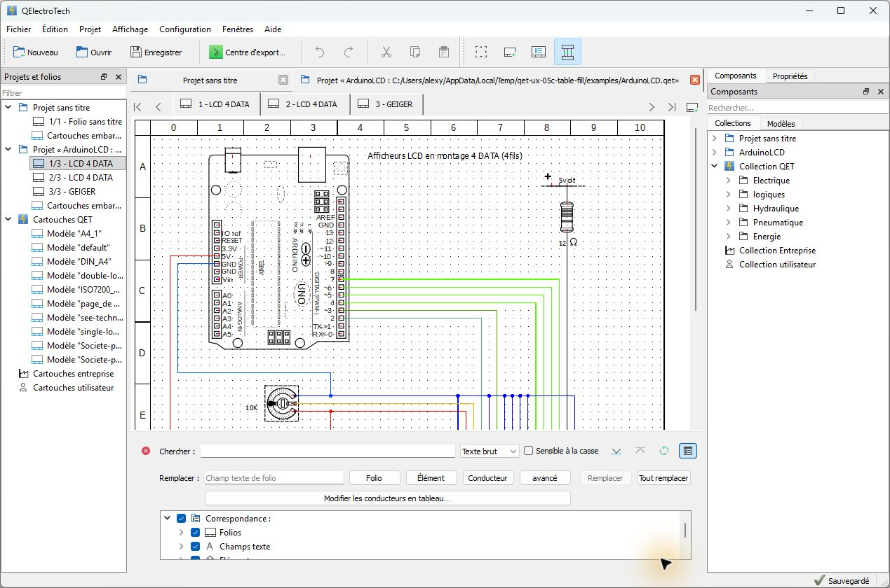
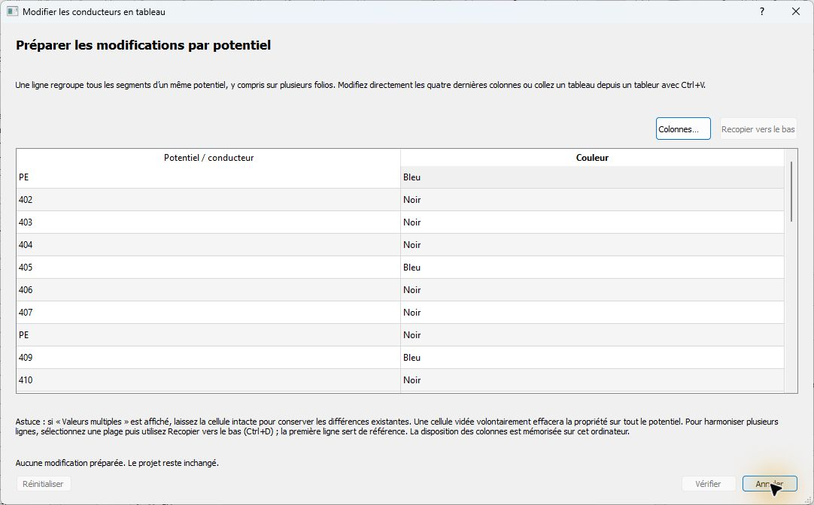

<p align="center">
  
</p>

# QElectroTech — fork ergonomie et productivité

[](https://github.com/GameKnightt/qelectrotech-source-mirror/actions/workflows/windows-build.yml)
[](LICENSE)
[](#tester-sous-windows-11)

> Préversion communautaire non officielle, basée sur QElectroTech 0.100.1.
> Elle vise à moderniser progressivement l’expérience de travail sans rompre
> les formats ni les habitudes du projet amont.

QElectroTech est un logiciel libre de CAO/IAO destiné à la création de schémas
électriques, d’automatisme, pneumatiques, hydrauliques et process. Ce fork
conserve ce socle métier et se concentre sur quatre objectifs : réduire les
frictions sous Windows 11, rendre les opérations critiques plus fiables,
accélérer les tâches répétitives et clarifier l’interface.

- [Projet officiel QElectroTech](https://qelectrotech.org/)
- [Sources officielles](https://github.com/qelectrotech/qelectrotech-source-mirror)
- [Forum QElectroTech](https://qelectrotech.org/forum/)
- [Documentation du fork](docs/audit/qet-audit.md)

## Aperçu

### Espace de travail et projet ouvert



*Windows 11, projet public `ArduinoLCD.qet`, espace de travail et recherche avancée.*

### Édition tabulaire des conducteurs



*Windows 11, projet public `industrial.qet`, édition par potentiel et disposition
de colonnes personnalisable et persistante.*

## Ce que le fork ajoute

| Domaine | Changements disponibles |
|---|---|
| Fiabilité | Écritures d’export atomiques, base projet SQLite reconstruite dans une transaction, état de sauvegarde fiable, copies de récupération vérifiées, historique Undo conservé après sauvegarde |
| Windows et DPI | Dialogues adaptatifs, contrôles clavier et texte à 150 %, build MSYS2/UCRT64 reproductible, préversion portable isolée |
| Démarrage et interface | Centre de démarrage orienté tâche, profils **Essentiel** et **Classique**, shell contextuel, actions principales hiérarchisées |
| Navigation | Navigation rapide entre folios, prise en charge déterministe des grands projets, recherche des collections séparée de leur exploration |
| Propriétés | Inspecteur contextuel, sélection et édition des conducteurs plus prévisibles |
| Exports | Centre d’export unifié, erreurs visibles, export PDF/PNG/SVG et données métier protégés contre les faux succès |
| Conducteurs | Aperçu avant application, édition tabulaire groupée, collage TSV, recopie vers le bas, colonnes configurables et export CSV de revue |

Le détail technique, les critères d’acceptation et les limites de chaque lot sont
réunis dans l’[index des implémentations](docs/audit/implementation/README.md).

## Tester sous Windows 11

La préversion Windows est portable, non signée et n’écrase pas l’installation
officielle. Utilisez d’abord une copie de vos projets importants.

1. Téléchargez la dernière archive de préversion depuis les
   [Releases du fork](https://github.com/GameKnightt/qelectrotech-source-mirror/releases).
2. Extrayez l’archive dans un chemin local court.
3. Fermez les autres instances de QElectroTech.
4. Double-cliquez sur `Launch-QElectroTech-Preview.bat`.
5. Ouvrez une **copie** d’un projet existant.

Le lanceur utilise le dossier local `conf/` pour séparer les préférences de la
préversion. Les collections, cartouches, traductions, plugins Qt et dépendances
Windows sont inclus dans le paquet.

### Contrôle rapide en cinq minutes

1. Vérifiez le centre de démarrage puis ouvrez un projet.
2. Passez entre les profils **Essentiel** et **Classique**.
3. Naviguez entre les folios et recherchez un composant.
4. Ouvrez le centre d’export.
5. Utilisez la recherche avancée puis **Modifier les conducteurs en tableau…**.
6. Modifiez une copie du projet : le statut doit passer à **Modifié**.
7. Enregistrez avec `Ctrl+S` : le statut ne doit revenir à **Sauvegardé**
   qu’après la fin réelle de l’écriture.
8. Vérifiez que Undo/Redo reste disponible après la sauvegarde.

Consultez le [guide de la préversion portable](docs/development/windows-portable-preview.md)
pour le packaging et les contrôles de manifeste.

## Compatibilité et niveau de confiance

Les incréments actuels ne modifient pas les contrats de fichiers existants :

- projets `.qet` ;
- éléments `.elmt` ;
- cartouches XML ;
- collections et traductions ;
- base SQLite interne et exports existants.

Le profil **Classique** et les actions métier historiques restent disponibles.
Les changements de données sont protégés par Undo lorsque le parcours le permet.

Validation de cette préversion :

- compilation de l’application complète sous Windows 11 / Qt 5 / UCRT64 ;
- **36/36 tests CTest** réussis en série ;
- tests Windows natifs clavier et mise à l’échelle 150 % réussis ;
- ouverture CLI d’un projet public de 50 folios : 618 éléments et 671
  conducteurs détectés ;
- parcours graphique réel : ouverture, modification, enregistrement et retour à
  **Sauvegardé** ;
- paquet portable contrôlé par manifeste SHA‑256.

### Limites actuelles

- préversion Windows non signée ;
- qualification principale sous Windows 11 et Qt 5 ;
- parité Linux, macOS et Qt 6 non revendiquée pour cette distribution ;
- inventaire final des licences tierces, signature et test sur machine Windows
  propre encore requis avant une publication stable ;
- borniers, câbles, E/S automate, pneumatique, hydraulique et process doivent
  encore être validés sur des projets métier anonymisés représentatifs ;
- thème sombre, contraste élevé et certains scénarios à 200 % restent à
  compléter.

## Documentation

| Document | Contenu |
|---|---|
| [Audit complet](docs/audit/qet-audit.md) | Architecture, parcours, forces, risques et limites observées |
| [Backlog et roadmap](docs/audit/backlog-roadmap.md) | Priorités P0 à P3, critères d’acceptation et horizons produit |
| [Registre des preuves](docs/audit/evidence/README.md) | Captures, tests et résultats des validations |
| [Implémentations](docs/audit/implementation/README.md) | Résultat et contrat de chaque lot livré |
| [Notes de préversion](docs/releases/preview-2026-07.md) | Changements, validation, installation et limites de la préversion Windows |
| [Build Windows 11](docs/development/windows-msys2-build.md) | Compilation Qt 5 avec MSYS2 UCRT64 |
| [Paquet portable](docs/development/windows-portable-preview.md) | Déploiement, isolation et manifeste SHA‑256 |

## Roadmap résumée

- **Maintenant :** stabiliser l’intégration Windows, le paquet portable, les
  licences et les tests de compatibilité de formats.
- **Ensuite :** poursuivre la refonte progressive des parcours, les modèles de
  démarrage, les propriétés et les exports.
- **Fonctions industrielles :** borniers et câbles, E/S automate, désignation
  IEC 81346, routage intelligent et bus.
- **Architecture :** convergence Qt 6/KF6, automatisation CLI/API et
  intégrations externes.

La roadmap détaillée reste la source de vérité pour les priorités, dépendances
et critères d’acceptation : [backlog-roadmap.md](docs/audit/backlog-roadmap.md).

## Compiler et contribuer

Pour éviter le téléchargement Git LFS de la documentation Qt Creator, qui n’est
pas nécessaire au build, le clone Windows recommandé est :

```bash
GIT_LFS_SKIP_SMUDGE=1 git clone --recursive \
  https://github.com/GameKnightt/qelectrotech-source-mirror.git
cd qelectrotech-source-mirror
git remote add upstream \
  https://github.com/qelectrotech/qelectrotech-source-mirror.git
```

Le guide [Windows MSYS2/UCRT64](docs/development/windows-msys2-build.md) contient
les dépendances, les options CMake et les commandes de test. Les contributions
doivent rester découpées en incréments vérifiables, préserver les formats et
ajouter une preuve Windows pour tout changement d’interface.

Consultez également [CONTRIBUTING.md](CONTRIBUTING.md).

## Projet amont, attribution et licence

Ce dépôt est un fork de QElectroTech, projet développé depuis 2007 par l’équipe
et la communauté QElectroTech. Il ne constitue pas une distribution officielle
et ses modifications spécifiques ne sont pas nécessairement prises en charge
par l’équipe amont.

QElectroTech et les modifications de ce fork sont distribués selon les termes
de la GNU General Public License version 2. Consultez [LICENSE](LICENSE). Les
sous-modules, dépendances et collections conservent leurs propres avis de droit
d’auteur et de licence.

- [Site officiel](https://qelectrotech.org/)
- [Sources officielles](https://github.com/qelectrotech/qelectrotech-source-mirror)
- [Wiki officiel](https://qelectrotech.org/wiki_new/)
- [Soutenir le projet QElectroTech amont](https://www.paypal.com/donate/?cmd=_s-xclick&hosted_button_id=ZZHC9D7C3MDPC)
