# Architecture IA, MCP et interface QML

## Décision

Le premier socle IA du fork est un serveur
[Model Context Protocol](https://modelcontextprotocol.io/) local intégré au
binaire QElectroTech. Il expose le vrai modèle C++/Qt de l’application à un
client compatible MCP, par exemple Claude, ChatGPT, Gemini ou un agent
d’entreprise.

Cette approche est retenue avant l’intégration d’un modèle directement dans
l’application :

- QElectroTech ne stocke ni clé API, ni jeton, ni conversation ;
- l’utilisateur choisit son fournisseur et garde la maîtrise des coûts ;
- le serveur reste utilisable hors ligne pour les opérations locales ;
- les règles de lecture, d’écriture et de périmètre sont indépendantes du
  fournisseur ;
- le domaine QElectroTech reste en C++/Qt et ne dépend pas d’un SDK IA.

Le protocole utilisé est MCP `2025-11-25` sur `stdio`, avec compatibilité de
négociation pour `2025-06-18`, `2025-03-26` et `2024-11-05`.

## Limite d’architecture QML

L’application reste Qt 5, C++17 et Qt Widgets. Le nouveau panneau
**Automatisation et IA** constitue une limite de modernisation explicite :

- `QDockWidget` conserve l’intégration native dans la fenêtre principale ;
- `QQuickWidget` héberge une vue Qt Quick fondée sur les primitives natives ;
- `AutomationCenterController` expose au QML des propriétés et commandes
  typées ;
- aucune logique de document, de XML ou d’écriture n’est placée en JavaScript ;
- aucun module de contrôles QML externe n’est requis par le paquet portable ;
- les écrans historiques ne sont pas migrés implicitement vers QML ;
- le passage à Qt 6 reste un programme distinct.

```mermaid
flowchart LR
    A["Client IA compatible MCP"] -->|"JSON-RPC sur stdio"| B["QElectroTech --mcp-stdio"]
    B --> C["QetMcp::ProjectService"]
    C --> D["QETProject / Diagram / Element / Terminal"]
    D --> E["Fichiers .qet XML"]
    F["Dock Qt Widgets"] --> G["QQuickWidget + AutomationCenter.qml"]
    G --> H["AutomationCenterController"]
    H -->|"commande et configuration"| A
```



## Démarrer le serveur

Le serveur est lancé comme un processus séparé par le client MCP :

```powershell
qelectrotech.exe --mcp-stdio --mcp-root "C:\Projets\QET"
```

Plusieurs `--mcp-root` peuvent être fournis, dans la limite de 32. Sans
`--mcp-root`, le répertoire courant est utilisé pour la compatibilité en ligne
de commande ; l’interface graphique génère toujours un périmètre explicite.

Exemple de configuration générique :

```json
{
  "mcpServers": {
    "qelectrotech": {
      "command": "C:\\QElectroTech\\qelectrotech.exe",
      "args": [
        "--mcp-stdio",
        "--mcp-root",
        "C:\\Projets\\QET"
      ]
    }
  }
}
```

Le panneau **Projet > Automatisation et IA…** génère la commande et ce bloc
JSON à partir du projet actif. Les emplacements de configuration propres à
chaque client restent documentés par son éditeur.

## Outils disponibles

| Outil | Mode | Résultat |
|---|---|---|
| `qet.project.inspect` | Lecture | Charge le projet avec `QETProject` et retourne titre, UUID, version déclarée, folios, éléments, conducteurs et bornes libres |
| `qet.project.validate` | Lecture | Vérifie le XML, la racine `<project>`, le chargement par le modèle, les UUID de folio et les titres manquants |
| `qet.project.create` | Écriture | Crée un nouveau `.qet` et ses folios vides avec le sérialiseur QElectroTech |
| `qet.project.set_titleblock` | Écriture | Applique les champs de cartouche au projet et aux folios dans une nouvelle copie |

Les résultats réussis sont fournis dans `structuredContent` et sous forme de
texte JSON pour les clients ne consommant pas encore les résultats structurés.

## Contrat de sécurité

Le serveur suit un modèle de moindre privilège :

1. lecture seule par défaut ;
2. écriture activée uniquement avec `--mcp-write` ;
3. `confirm=true` obligatoire dans chaque appel d’écriture ;
4. destination `.qet` distincte et inexistante ;
5. aucun remplacement silencieux de la source ;
6. chemins canoniques limités aux racines autorisées ;
7. contrôle du parent canonique pour bloquer les sorties par lien symbolique ;
8. rejet explicite des chemins relatifs qui deviennent absolus sur un autre
   volume Windows ou partage UNC ;
9. écriture dans un fichier temporaire adjacent, puis publication exclusive
   sans remplacement (renommage Windows ou lien atomique Unix), qui échoue si
   la destination a été créée entre-temps ;
10. refus non interactif des projets créés par une version plus récente ou par
    QElectroTech 0.6 et antérieur, afin qu’aucun dialogue modal ne bloque le
    transport `stdio` ;
11. arguments inconnus rejetés et enveloppes JSON-RPC/MCP validées ;
12. limite de 1 Mio par message `stdio`, 512 Mio par projet, 200 folios à la
    création, 64 champs de cartouche et longueurs de chaînes bornées ;
13. décision finale laissée au client et à l’utilisateur humain.

Le transport `stdio` réserve `stdout` aux messages JSON-RPC. Les diagnostics
restent sur `stderr`. Aucun port réseau n’est ouvert.

## Compatibilité des données

Le serveur n’effectue pas de réécriture XML générique. Il passe par les classes
existantes `QETProject`, `Diagram`, `Element`, `Terminal` et
`TitleBlockProperties`, puis utilise le sérialiseur QElectroTech.

Les contrats suivants restent inchangés :

- projet `.qet` et structure XML historique ;
- éléments `.elmt` ;
- cartouches et champs personnalisés ;
- bibliothèques, traductions et préférences ;
- ouverture des fichiers sources par la version stable.

Les opérations d’écriture produisent volontairement une nouvelle copie afin
que l’utilisateur puisse comparer, valider puis remplacer manuellement son
document.

## Validation

- test d’intégration MCP du cycle `initialize` → `tools/list` → création →
  inspection → cartouches → validation → `ping` ;
- enveloppes invalides, identifiants MCP incorrects et message supérieur à
  1 Mio rejetés sans désynchroniser la session ;
- absence d’écrasement, métadonnée `savedfilepath` finale et limites de chaînes
  vérifiées ;
- projets futurs et hérités 0.6 refusés sans dialogue bloquant, avec résultat
  de validation structuré ;
- test QML au clavier et à largeur minimale ;
- défilement clavier, révélation du contrôle focalisé, compteurs volumineux,
  texte littéral et curseur de défilement minimal couverts ;
- test QML avec `QT_SCALE_FACTOR=1.5` ;
- chargement du panneau dans l’application Windows réelle à 1920×1080 ;
- `qmllint-qt5` sans erreur ;
- compilation du binaire complet Qt 5/UCRT64.

## Incréments suivants

Le socle est volontairement borné. Les extensions devront conserver aperçu,
validation, copie de sortie et confirmation humaine :

1. ressources MCP pour la bibliothèque d’éléments et les métadonnées projet ;
2. outils de nomenclature, références croisées et contrôle de cohérence ;
3. plan de modification structuré avec diff avant application ;
4. placement d’éléments par identités stables, coordonnées et règles métier ;
5. conducteurs et routage assistés, avec Undo atomique dans l’interface ;
6. génération de folios à partir de modèles validés par discipline ;
7. transport distant optionnel seulement avec authentification, journalisation,
   quotas et isolation explicitement conçus ;
8. agent embarqué éventuel uniquement après décision produit sur le fournisseur,
   les coûts, la confidentialité et le mode hors ligne.

## Références MCP

- [Cycle de vie MCP 2025-11-25](https://modelcontextprotocol.io/specification/2025-11-25/basic/lifecycle)
- [Transports MCP 2025-11-25](https://modelcontextprotocol.io/specification/2025-11-25/basic/transports)
- [Outils MCP 2025-11-25](https://modelcontextprotocol.io/specification/2025-11-25/server/tools)
